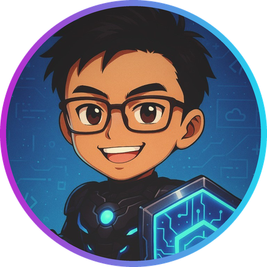

> *"In a world where threats lurk in the shadows of the digital realm, I rise with my shield — not of iron, but of code."*

Welcome to my GitHub Isekai!
I'm **CyberZal**, a passionate **Cloud & Cybersecurity Explorer**, walking the path of the **CyberShield Hero** — inspired by the resilience of anime heroes and the mission to safeguard the digital world.

Previously served as Cybersecurity Intern @ **RAiD** (RSAF Agile innovation Digital)!

---

## ⚔️ About Me

- 🎓 **MBA in Cybersecurity** — *graduated* ✅
- 📚 Currently pursuing **Specialist Diploma in Cybersecurity Management**
- 🌐 Mid-career adventurer shifting into **Cyber Defense & Pentesting**
- 💻 Background: IT engineering, cloud foundations, and a touch of DevOps magic
- 🎵 Ex-underground singer-songwriter, now coding verses in **Python, Linux, and Cybersecurity frameworks**
- 🐾 Loves **anime, manga, and cats** (guardian companions on this quest)

---

## 🛡️ Hero's Arsenal

📜 Plain-text loadout (for the recruiters' scrying orbs)

- **AI Stack:** ChatGPT · Claude · Gemini · Hermes · Skywork · Venice  · Sakana
- **Class Specializations:** Security Vibe Coder · AI Security Engineer · AI Web & App Builder
- **Cybersecurity:** Security frameworks, threat modeling, cloud security principles
- **Cloud & DevOps:** AWS, Azure, Flask, Git, CI/CD basics, Docker (learning)
- **Languages:** Python, Bash scripting

---

## 📖 Current Quest Log

- 🏰 Building projects that blend **cybersecurity with creativity**
- 🔐 Strengthening skills towards **Hack The Box, Hackviser, and CyberWarFare Labs**
- 🌱 Writing my **light novel + anime-fantasy short stories** (*Threads of Harmony*) — <a href="https://www.royalroad.com/fiction/109034/threads-of-harmony-puppygirlprincesss-quest">read and support here</a>
- 🚀 Experimenting with **Flask apps, portfolio sites, and automation scripts**

---

## 🎮 Side Quests

- 🏋️ Getting back into **calisthenics training** (hero needs stamina)
- 🎶 Writing songs/poetry infused with **R&B soul and storytelling**
- ✨ Exploring **anime-inspired designs** for cybersecurity branding

---

## 📜 Hero's Progress Log

---

## 🌟 Let's Connect

---

> *"Even if the odds are against me, as long as I hold the CyberShield, I'll stand guard over the digital frontier."*
