# 

# 🛡️ Rise of the CyberShield Hero

> *"In a world where threats lurk in the shadows of the digital realm, I rise with my shield — not of iron, but of code."*  

Welcome to my GitHub Isekai!  
I’m **CyberZal**, a passionate **Cloud & Cybersecurity Explorer**, walking the path of the **CyberShield Hero** — inspired by the resilience of anime heroes and the mission to safeguard the digital world.  

Previously served as Cybersecurity Intern @ RAiD (RSAF Agile innovation Digital)!

---

## ⚔️ About Me  
- 🌐 Mid-career adventurer shifting into **Cyber Defense & Pentesting**.  
- 📚 Currently pursuing **MBA in Cybersecurity** + **Specialist Diploma in Cybersecurity Management**.  
- 💻 Background: IT engineering, cloud foundations, and a touch of DevOps magic.  
- 🎵 Ex-underground singer songwriter, now coding verses in **Python, Linux, and Cybersecurity frameworks**.  
- 🐾 Loves **anime, manga, and cats** (guardian companions on this quest).  

---

## 🛡️ My Hero’s Arsenal (Skills)  
- **Cybersecurity:** Security frameworks, threat modeling, cloud security principles.  
- **Cloud & DevOps:** AWS, Azure, Flask, Git, CI/CD basics.  
- **Languages:** Python, Bash scripting. 
- **Other Tools:** GitHub, GitLab, Docker (learning).  

---

## 📖 Current Quest Log  
- 🏰 Building projects that blend **cybersecurity with creativity**.  
- 🔐 Strengthening skills towards **Hack the box, Hackviser, and CyberWarFare Labs**.  
- 🌱 Writing my **light novel + anime-fantasy short stories** (*Threads of Harmony*). <a href="https://www.royalroad.com/fiction/109034/threads-of-harmony-puppygirlprincesss-quest"> Click here to read and support</a>  
- 🚀 Experimenting with **Flask apps, portfolio sites, and automation scripts**.  

---

## 🎮 Side Quests  
- 🏋️ Getting back into **calisthenics training** (hero needs stamina).  
- 🎶 Writing songs/poetry infused with **R&B soul and storytelling**.  
- ✨ Exploring **anime-inspired designs** for cybersecurity branding.  

---

## 📜 Hero’s Progress Log

---

## 🌟 Let’s Connect  
- 💼 [LinkedIn](https://www.linkedin.com/in/cyberzal)  

---

> *“Even if the odds are against me, as long as I hold the CyberShield, I’ll stand guard over the digital frontier.”*  
